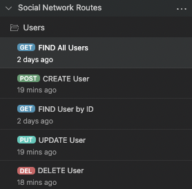

# User-Thoughts: Social Media Site API


<hr />

<br />

## Quick Links

[Video Link to Walkthrough](https://)


## Description
  
This is a back-end API package built on a Mongo database, featuring Express.js and Mongoose  to handle a potentially large amount of data with a loose structure. The API provides for both the <b>creation</b> of Users, who can perform CRUD operations on their "thoughts," add "reactions" in text form to other users' thoughts, befriend other users, and for the <b>deletion</b> of those same details.


## Table of Contents

- [Installation](#installation)
- [Usage](#usage)
- [License](#license)
- [Questions](#questions)


## Installation

To install, download or clone the necessary files from the gitHub repository, which can be found [HERE](https://github.com/LujanSolo/social-network-api).


## Usage

After cloning the github files into a directory on your PC, open Insomnia (or ThunderClient, Postman, etc.) to test the routes. Below is a screenshot of the route-call structure, detailing the available CRUD operations for each route: 

<br />

     

<br />

As seen detailed above, `USERS`, `THOUGHTS`, `REACTIONS`, and `FRIENDS` each have specific, and differing, CRUD operations available to each of them.
<br />
<br />

### API ROUTES
<br />

**USERS**

**`/api/users`**

<br />

To begin testing routes in Insomnia, POST or create a new user. Copy the following object:
```json
{
  "username": "Jack",
  "email": "jack@gmail.com"
}
```
Paste that information into the `Json Content` section of Insomnia, Postman, or Thunderclient (seen below). In addition, copy and paste the following line into your POST route, then click `Send`:
```
http://localhost:3001/api/users
```
<br />

You can see the new user has been created with a unique ID, and has several sub-documents (the arrays of 'thoughts' and 'friends') contained within the object.


<br />

We can also get all users, get a single user by their unique ID, update a user, and delete a user (and their thoughts), shown in the following screenshots.

1. <u>GET ALL USERS:</u>

    

2. <u>GET a USER by ID, where the ID is included in the address:</u>

    

3. <u>UPDATE a USER, where the ID is included in the address:</u>

    

4. <u>DELETE a USER, where the ID is included in the address:</u>

    

<br />

**THOUGHTS**

**`/api/thoughts`**

All of the `thoughts` have the same `CRUD` operations available to them as did the `user`, as can be seen in a few examples below. Be sure to change your route address to:
```
http://localhost:3001/api/thoughts
```

- Create Thought test route:

  

- Update Thought test route:

  

<i>Note: all routes are further detailed in the walk-thru video.</i>

<br />

**REACTIONS**

**`/api/thoughts/:thoughtId/reactions`**

Users may also `post` and `delete` reactions to other users' thoughts, via the thought's ID (and the reaction ID for deletion), as shown below:

  - Add Reaction to a thought:

  

  - Delete Reaction to a thought:

  

<br />

**FRIENDS**

**`/api/users/:userId/friends/:friendId`**

Users may also `add` and `delete` friends via their ID's. 

  - Add Friend test route:

  

  - Remove Friend test route:

  


## License

This project is covered under the [MIT License](https://opensource.org/licenses/MIT).


## Questions

GitHub profile: https://github.com/LujanSolo

Contact me at lujansolo@proton.me for additional inquiries.
